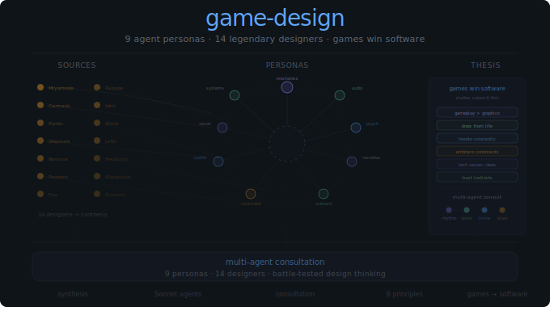

# Game Design Plugin

<p align="center">
  
</p>

Nine specialized design consultants synthesized from fourteen legendary game designers. Each agent represents a design role — not an individual — with complementary perspectives fused into focused expertise.

## Personas

| Agent | Focus | Sources |
|-------|-------|---------|
| Core Mechanics Architect | Feel, rhythm, moment-to-moment gameplay | Miyamoto, Carmack, Jaffe, Koizumi |
| Audio-Experience Designer | Music, sound, rhythm integration | Fox, Rigopulos, Miyamoto |
| Player Psychology Guide | Motivation, emotion, difficulty curves | Miyamoto, Pardo, Rigopulos, Jaffe |
| Narrative-Mechanics Weaver | Story through gameplay, environmental storytelling | Fox, Urquhart, Nomura |
| Onboarding & Accessibility Sage | Tutorial-free teaching, inclusive design | Miyamoto, Koizumi, Rigopulos, Fox |
| Constraint Alchemist | Scope management, turning limits into features | Persson, Fox, Carmack |
| Spatial & Camera Advisor | Level layout, camera control, space design | Koizumi, Tezuka, Ward |
| Visual Identity Consultant | Art direction, character design, style cohesion | Nomura, Ishii, Miyamoto |
| Systems Designer | Emergent gameplay, progression loops | Hedlund, Persson, Pardo |

All agents run on Sonnet.

## When to Consult

**Core Mechanics Architect** — "How should the primary interaction feel?" · "Players aren't satisfied by the core loop" · "The controls feel unresponsive"

**Audio-Experience Designer** — "How can music drive gameplay?" · "When should sound reinforce vs. contrast?" · "The audio feels disconnected"

**Player Psychology Guide** — "Players are quitting at this difficulty spike" · "How do I frame challenge to feel fair?" · "What should the reward loop feel like?"

**Narrative-Mechanics Weaver** — "How can puzzles reflect the story themes?" · "The narrative feels bolted on" · "Can the environment tell the backstory?"

**Onboarding & Accessibility Sage** — "How do I teach this without a tutorial?" · "Players aren't discovering abilities" · "How can I make this accessible without making it easy?"

**Constraint Alchemist** — "I only have 6 months and one programmer" · "Should I cut this or simplify it?" · "How do I scope for a solo developer?"

**Spatial & Camera Advisor** — "Camera feels disorienting in tight spaces" · "How should levels guide players toward secrets?" · "Open world vs. linear?"

**Visual Identity Consultant** — "How do I establish a cohesive art style?" · "Character designs don't feel memorable" · "How do I use color to reinforce game state?"

**Systems Designer** — "How should the upgrade system work?" · "Players are breaking the economy" · "How much emergent behavior is too much?"

## Multi-Agent Consultations

For complex design problems, multiple agents provide complementary perspectives:

| Combination | Use When |
|-------------|----------|
| Core Mechanics + Audio | Core action involves rhythm |
| Player Psychology + Onboarding | Designing difficulty curves |
| Narrative + Visual Identity | Building thematic cohesion |
| Constraints + Systems | Scoping complex features |

## Sources

| Designer | Key Works | Core Contribution |
|----------|-----------|-------------------|
| Shigeru Miyamoto | Mario, Zelda, Pikmin | Core feel, accessibility |
| John Carmack | Doom, Quake | Tech serving gameplay |
| Rob Pardo | StarCraft, WoW | Balance, "easy/impossible" |
| Feargus Urquhart | Baldur's Gate, Fallout | Narrative depth |
| Tetsuya Nomura | FF VII, Kingdom Hearts | Character design |
| Markus Persson | Minecraft | Emergent systems, scope |
| Toby Fox | Undertale, Deltarune | Subversion, music-narrative |
| Koichi Ishii | Final Fantasy, Mana | Visual identity |
| Alex Ward | Burnout Paradise | Visceral feel, open world |
| David Jaffe | God of War | Emotion through interaction |
| Stieg Hedlund | Diablo II | Systems, loot, progression |
| Alex Rigopulos | Guitar Hero, Rock Band | Music games, accessibility |
| Takashi Tezuka | Mario, Animal Crossing | World-building, level design |
| Yoshiaki Koizumi | Mario Galaxy | Camera, spatial design |

## Thesis

Six principles distilled from their collective wisdom:

1. **Gameplay over graphics or story** — The moment-to-moment must be compelling
2. **Draw from life, not other games** — Originality comes from observation
3. **Iterate constantly** — Feel evolves through testing
4. **Embrace constraints** — Limits breed creativity
5. **Technology serves ideas** — Not the other way around
6. **Trust your instincts** — Playtest validates, but vision leads

## Installation

```bash
/plugin install game-design@crewchief
```

## Links

- [Repository](https://github.com/manifoldlogic/claude-code-plugins)
