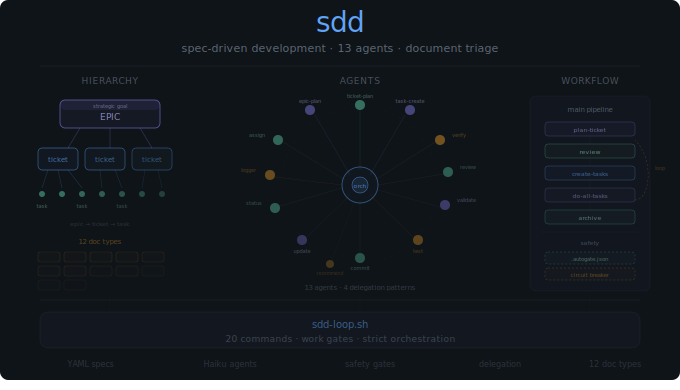

# SDD Plugin

<p align="center">
  
</p>

Spec-Driven Development. Structure ambiguous work into epics, tickets, and tasks. Thirteen agents handle planning, review, implementation, and verification. A strict orchestration pipeline keeps everything moving through document triage, safety gates, and autonomous execution.

## Hierarchy

Work decomposes top-down:

```
Epic (research/discovery)
    └── Ticket (planning/execution)
            └── Task (individual work item)
```

Each ticket gets a tailored set of planning documents selected by keyword-based triage from 12 document types across three tiers.

### Document Types

| Tier | Document | Filename | When Generated |
|------|----------|----------|----------------|
| Core | Problem Analysis | `analysis.md` | Always |
| Core | Solution Architecture | `architecture.md` | Always |
| Core | Execution Plan | `plan.md` | Always |
| Standard | Product Requirements | `prd.md` | Default (can be N/A-signed) |
| Standard | Quality Strategy | `quality-strategy.md` | Default (can be N/A-signed) |
| Standard | Security Review | `security-review.md` | Default (can be N/A-signed) |
| Conditional | Observability Plan | `observability.md` | monitor, metric, log, alert, api, service |
| Conditional | Migration Plan | `migration-plan.md` | migrate, schema, database, rollback |
| Conditional | Accessibility Review | `accessibility.md` | ui, frontend, component, form, wcag |
| Conditional | API Contract | `api-contract.md` | api, endpoint, rest, graphql, openapi |
| Conditional | Operational Runbook | `runbook.md` | deploy, infrastructure, production, ops |
| Conditional | Dependency Audit | `dependency-audit.md` | dependency, package, library, npm, pip |

**Core** documents are always generated. **Standard** documents generate by default but may be N/A-signed when genuinely irrelevant. **Conditional** documents only appear when trigger keywords in the ticket description match.

### Overrides

Force-include or force-exclude documents with `+doc` and `-doc` flags:

```bash
# Force include observability and api-contract, skip runbook
/sdd:plan-ticket "backend API service" +observability +api-contract -runbook
```

Core documents cannot be excluded. Invalid override names produce a warning but don't block the workflow.

## Agents

### Haiku (Fast, Structured)

| Agent | Purpose |
|-------|---------|
| `status-reporter` | Format status data into reports |
| `structure-validator` | Validate ticket structure |
| `unit-test-runner` | Execute tests and report results |
| `commit-task` | Create conventional commits |
| `workflow-logger` | Record workflow events |

### Sonnet (Reasoning)

| Agent | Purpose |
|-------|---------|
| `epic-planner` | Research and plan epics |
| `ticket-planner` | Create planning documents |
| `ticket-reviewer` | Critical ticket review |
| `ticket-updater` | Update ticket from review findings |
| `task-creator` | Generate tasks from plans |
| `verify-task` | Verify acceptance criteria |
| `agent-recommender` | Recommend specialized agents |
| `agent-assigner` | Assign agents to phases |

## Workflow

### Commands

| Command | Description |
|---------|-------------|
| `/sdd:start-epic` | Create epic for research/discovery |
| `/sdd:plan-ticket [desc] [+doc -doc]` | Create ticket with planning documents |
| `/sdd:import-jira-ticket [KEY]` | Import Jira ticket and create planning docs |
| `/sdd:review [TICKET_ID]` | Critical review before task creation |
| `/sdd:create-tasks [TICKET_ID]` | Generate tasks from plan |
| `/sdd:do-task [TASK_ID]` | Complete single task workflow |
| `/sdd:do-all-tasks [TICKET_ID]` | Execute all tasks (supports `--parallel`) |
| `/sdd:code-review [TICKET_ID]` | Post-implementation code review |
| `/sdd:pr [TICKET_ID]` | Create GitHub PR |
| `/sdd:fix-pr-feedback [PR]` | Evaluate and fix valid PR feedback |
| `/sdd:extend [TICKET_ID]` | Create follow-up tasks mid-cycle |
| `/sdd:recommend-agents [TICKET_ID]` | Recommend specialized agents |
| `/sdd:assign-agents [TICKET_ID]` | Assign agents to phases |
| `/sdd:update [TICKET_ID]` | Update ticket from review findings |
| `/sdd:status` | Comprehensive status overview |
| `/sdd:tasks-status [TICKET_ID]` | Task-level status |
| `/sdd:tickets-status` | Ticket-level status |
| `/sdd:epics-status` | Epic-level status |
| `/sdd:archive [TICKET_ID]` | Archive completed ticket |
| `/sdd:setup` | Initialize SDD environment |

Most commands accept optional instructions after the primary argument: `/sdd:review AUTH Focus on security concerns`.

### Quick Start

```bash
# 1. Plan ticket (triage selects relevant documents)
/sdd:plan-ticket Implement user authentication with OAuth

# 2. Review the plan
/sdd:review AUTH

# 3. Generate tasks
/sdd:create-tasks AUTH

# 4. Execute all tasks
/sdd:do-all-tasks AUTH

# 5. Code review
/sdd:code-review AUTH

# 6. Ship and archive
/sdd:pr AUTH
/sdd:archive AUTH
```

Task execution follows a strict pipeline: **implement** (Sonnet) → **test** (Haiku) → **verify** (Sonnet) → **commit** (Haiku).

### Parallel Execution

For tickets with independent tasks, opt into concurrent execution:

```bash
/sdd:do-all-tasks TICKET_ID --parallel
```

Expect ~20-30% improvement with 3+ independent tasks per phase. Small or linear tickets see no benefit — use sequential (the default) for those.

### Loop Controller

`sdd-loop.sh` provides autonomous task execution across multiple repositories:

```bash
# Preview what would happen
./sdd-loop.sh --dry-run /path/to/repos/

# Run with limits
./sdd-loop.sh --max-iterations 50 --max-errors 3 /path/to/repos/
```

Phase boundaries via `.autogate.json` stop execution after specific phases for manual review. See [loop examples](skills/project-workflow/scripts/sdd-loop-examples.md) for detailed usage.

## Safety

### Work Gates

`.autogate.json` files in ticket or epic directories control autonomous work:

```json
{"ready": false}                    // Block all autonomous work
{"ready": true, "stop_at_phase": 1} // Stop after Phase 1
{"ready": true}                     // Fully ready (same as no file)
```

Gates integrate with the workflow guidance Stop hook — when a gate blocks, the hook exits early with a clear message. Invalid JSON or missing files fail safe (work continues).

Bypass temporarily: `export AUTOGATE_BYPASS=true`

### Hook Chain

Two PreToolUse hooks run on every Bash command:

1. **block-dangerous-git.py** — Blocks `git reset --hard`, `git clean -fd`
2. **block-catastrophic-commands.py** — Blocks `rm -rf /`, `chmod -R 777 /`, `dd of=/dev/sd*`

Blocked commands exit with code 2 before execution.

### Circuit Breaker

The loop controller logs advisory warnings at iterations 25 and 40. These are informational only — the loop stops at legitimate milestones: no work remaining, max iterations reached, phase boundary hit, or user interrupt.

### Workflow Guidance

A Stop hook analyzes recent conversation to detect SDD context and suggests next steps (planning, implementation, or verification). Disable with `export SDD_DISABLE_STOP_HOOK=1`.

## Installation

```bash
/plugin marketplace add manifoldlogic/claude-code-plugins
/plugin install sdd@crewchief
```

## Configuration

| Variable | Default | Description |
|----------|---------|-------------|
| `SDD_ROOT_DIR` | `/app/.sdd` | Location of SDD data directory |
| `SDD_DISABLE_STOP_HOOK` | unset | Set to `1` to disable workflow guidance |
| `AUTOGATE_BYPASS` | unset | Set to `true` to bypass work gates |
| `SDD_TASKS_API_ENABLED` | `true` | Set to `false` to disable Tasks API |

## Troubleshooting

| Issue | Solution |
|-------|----------|
| Tickets not found | Check `echo ${SDD_ROOT_DIR:-/app/.sdd}/tickets/` exists |
| Verification failures | Run tests first, ensure all acceptance criteria have evidence |
| Archive failures | All tasks must have "Verified" checkbox checked |
| Tasks API unavailable | Automatic fallback to file-only mode |
| Parallel mode slow | Only benefits tickets with 3+ independent tasks per phase |
| Gate not blocking | Verify `.autogate.json` is in the correct directory |
| Gate blocking unexpectedly | Check for `.autogate.json` in current work item directory |

## Links

- [Repository](https://github.com/manifoldlogic/claude-code-plugins)
- [Safety Guidelines](docs/safety-guidelines.md)
- [Workflow Skill](skills/project-workflow/SKILL.md)
