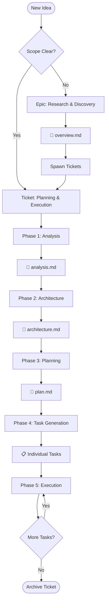
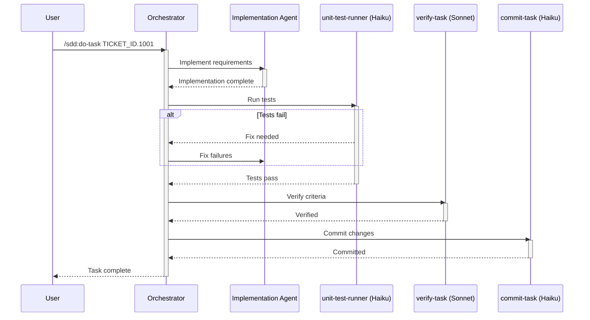

# Spec-Driven Development with SDD

## Process Overview



---

## Workflow Hierarchy

### Epics (Optional - Research Phase)

**When to use:** Exploring problem spaces, conducting research before knowing exact deliverables.

**Location:**
- Without Jira ID: `${SDD_ROOT_DIR}/epics/{DATE}_{name}/`
- With Jira ID: `${SDD_ROOT_DIR}/epics/{DATE}_{JIRA_ID}_{name}/`

**Examples:**
- `2025-12-22_api-redesign`
- `2025-12-22_UIT-444_best-epic-name`

**Documents:**
- `overview.md` - Vision, goals, research findings
- `opportunity-map.md` - Problem space analysis
- `domain-model.md` - Key concepts and relationships
- `decisions.md` - Research decisions and rationale

**Command:** `/sdd:start-epic [name]` or `/sdd:start-epic UIT-444 epic-name`

### Tickets (Planning & Execution)

**When to use:** Known deliverables, ready for planning and execution.

**Location:** `${SDD_ROOT_DIR}/tickets/{TICKET_ID}_{name}/`

**Documents:**
- `README.md` - Ticket overview and status
- `planning/analysis.md` - Problem analysis and research
- `planning/architecture.md` - Technical design
- `planning/plan.md` - Implementation phases and tasks
- `planning/quality-strategy.md` - Testing approach
- `planning/security-review.md` - Security considerations

**Command:** `/sdd:plan-ticket [description]`

### Tasks (Individual Work Items)

**Location:** `${SDD_ROOT_DIR}/tickets/{TICKET_ID}_{name}/tasks/{TICKET_ID}.{NUMBER}_description.md`

**Workflow:** Implement → Test → Verify → Commit

**Command:** `/sdd:do-task [TASK_ID]`

---

## Phase 1: Analysis

### Purpose
Understand the problem space, research solutions, and establish ticket context.

### Process
```bash
# Scaffold ticket structure
bash scripts/scaffold-ticket.sh "TICKET_ID" "ticket-name"

# Delegate to ticket-planner agent (Sonnet)
```

### Output: `planning/analysis.md`

```markdown
# Analysis

## Executive Summary
[1-2 paragraph overview of findings and recommendations]

## Problem Statement
### Current State
- What exists today
- Pain points
- Constraints

### Desired State
- Goals
- Success metrics
- User outcomes

## Research Findings
### Technical Landscape
- Available technologies
- Build vs buy options
- Integration requirements

## Feasibility Assessment
### Technical Feasibility
- Required technologies
- Skill requirements
- Technical risks

### Resource Feasibility
- Complexity assessment
- Dependency analysis

## Constraints & Assumptions
### Constraints
- Technical limitations
- Business requirements

### Assumptions
- What we're taking as given
- Dependencies on other systems

## Risk Analysis
| Risk | Probability | Impact | Mitigation Strategy |
|------|------------|--------|-------------------|
| [Risk] | High/Med/Low | High/Med/Low | [Strategy] |

## Recommendations
[Specific recommendation based on analysis]
```

---

## Phase 2: Architecture

### Purpose
Define the technical architecture, component design, and system structure.

### Output: `planning/architecture.md`

```markdown
# Architecture

## System Overview
[High-level description of the system architecture]

## Architecture Diagram


## Component Design
### Component: [Name]
#### Purpose
[What this component does]

#### Responsibilities
- Responsibility 1
- Responsibility 2

#### Interfaces
- Input: [Description]
- Output: [Description]

## Data Architecture
### Data Models
[Entity definitions and relationships]

### Data Flow
[How data moves through the system]

## Integration Points
| System | Type | Protocol | Format |
|--------|------|----------|--------|
| [System] | Sync/Async | REST/gRPC | JSON |

## Technical Decisions
### Decision: [Choice]
- **Options:** A, B, C
- **Decision:** [What was chosen]
- **Rationale:** [Why]
```

---

## Phase 3: Planning

### Purpose
Break down the architecture into implementable phases and specific tasks.

### Output: `planning/plan.md`

```markdown
# Implementation Plan

## Phase Overview
| Phase | Name | Deliverable | Success Criteria |
|-------|------|-------------|------------------|
| 1 | Foundation | Core infrastructure | Basic tests pass |
| 2 | Core Features | Main functionality | Features working |
| 3 | Integration | External connections | APIs connected |

## Phase 1: Foundation
### Goals
- Set up development environment
- Create ticket structure
- Implement core data models

### Tasks
| Task ID | Title | Description |
|---------|-------|-------------|
| TICKET_ID.1001 | Setup repository | Initialize structure |
| TICKET_ID.1002 | Core data models | Entity definitions |

### Exit Criteria
- [ ] Development environment working
- [ ] Core models implemented
- [ ] Basic tests passing

## Phase 2: Core Features
[Continue pattern...]
```

---

## Phase 4: Task Generation

### Purpose
Transform plan items into detailed, executable work tasks.

### Process
```bash
# Delegate to task-creator agent (Sonnet)
/sdd:create-tasks [TICKET_ID]
```

### Task Template

```markdown
# {TICKET_ID}.{NUMBER}: Title

## Status
- [ ] **Task completed** - All acceptance criteria met
- [ ] **Tests pass** - All tests executing successfully
- [ ] **Verified** - Verified by verify-task agent

## Context
**Ticket:** [Link to ticket]
**Dependencies:** [Previous tasks]

## Objective
[Clear statement of what this task accomplishes]

## Acceptance Criteria
- [ ] Criterion 1 (specific and measurable)
- [ ] Criterion 2 (specific and measurable)
- [ ] Criterion 3 (specific and measurable)

## Implementation Notes
### Approach
[How to implement this]

### Files to Modify
- `path/to/file1` - [What to change]
- `path/to/file2` - [What to change]

### Patterns to Follow
- Reference: [existing code/pattern]

## Testing Requirements
- [ ] Unit tests for new functionality
- [ ] Integration tests if applicable

## Out of Scope
- [What NOT to do]
```

---

## Phase 5: Agent Execution

### Purpose
Execute tasks through the agent pipeline to completion.

### Execution Flow



### Agent Pipeline

| Step | Agent | Model | Purpose |
|------|-------|-------|---------|
| 1 | Implementation | Sonnet | Build the solution |
| 2 | `unit-test-runner` | Haiku | Execute tests, report results with coverage |
| 3 | `verify-task` | Sonnet | Verify acceptance criteria |
| 4 | `commit-task` | Haiku | Create conventional commit |

### Commands

```bash
# Execute single task
/sdd:do-task TICKET_ID.1001

# Execute all tasks for a ticket
/sdd:do-all-tasks TICKET_ID

# Check status
/sdd:tasks-status TICKET_ID
```

---

## Scripts

All scripts are in the skill's `scripts/` directory:

| Script | Purpose | Usage |
|--------|---------|-------|
| `scaffold-epic.sh` | Create epic structure | `bash scripts/scaffold-epic.sh "name" "vision"` |
| `scaffold-ticket.sh` | Create ticket structure | `bash scripts/scaffold-ticket.sh "TICKET_ID" "name"` |
| `task-status.sh` | Get task status as JSON | `bash scripts/task-status.sh TICKET_ID` |
| `validate-structure.sh` | Verify ticket structure | `bash scripts/validate-structure.sh TICKET_ID` |
| `ticket-summary.sh` | Generate ticket summary | `bash scripts/ticket-summary.sh TICKET_ID` |

---

## Agents

### Haiku Agents (Fast, Structured Tasks)

Use for procedural tasks with clear steps:

| Agent | Purpose |
|-------|---------|
| `status-reporter` | Parse script output, format reports |
| `structure-validator` | Check file structure, report issues |
| `unit-test-runner` | Execute tests, report results with coverage |
| `commit-task` | Create commits after verification |

### Sonnet Agents (Reasoning, Analysis)

Use for tasks requiring judgment:

| Agent | Purpose |
|-------|---------|
| `epic-planner` | Research and plan epics |
| `ticket-planner` | Create comprehensive planning docs |
| `ticket-reviewer` | Critical review of tickets |
| `task-creator` | Generate tasks from plans |
| `verify-task` | Verify acceptance criteria met |

---

## Quality Gates

### Per-Task Gates
1. **Implementation Complete** - Code written
2. **Tests Passing** - All tests green
3. **Verified** - Acceptance criteria met
4. **Committed** - Changes saved

### Per-Ticket Gates
1. **All Tasks Complete**
2. **Integration Tests Pass**
3. **Documentation Updated**
4. **Ready for Archive**

---

## Deliverables (Optional Work Products)

**Purpose**: Standardized location for documents created during ticket execution that inform later phases or provide verification evidence.

### When to Use

- **Analysis reports**: Gap analyses, audit findings, research summaries
- **Verification evidence**: Compliance checks, quality gate proof
- **Cross-phase artifacts**: Phase 1 findings that inform Phase 2 implementation

### When NOT to Use

- **Codebase artifacts**: Commit to repository instead
- **Planning documents**: Use `planning/` directory instead
- **Task notes**: Add to task file instead

### Location

```
${SDD_ROOT_DIR}/tickets/{TICKET_ID}_{name}/deliverables/
```

### Naming Conventions

| Pattern | Example | Use Case |
|---------|---------|----------|
| `{content-description}.md` | `terminology-audit-report.md` | General deliverables |
| `{phase}-{content-description}.md` | `phase2-verification-report.md` | Phase-specific reports |

**Guidelines**:
- Use descriptive names: `terminology-audit-report.md`, not `report.md`
- Phase-prefix when relevant: `phase2-verification-report.md`
- Avoid version numbers: `findings-report.md`, not `report-v2-final.md`

### Examples from SDDREV Ticket

| Deliverable | Purpose |
|-------------|---------|
| `terminology-audit-report.md` | Findings from terminology audit task |
| `consolidated-findings-report.md` | Aggregated results across phases |
| `phase2-verification-report.md` | Proof of Phase 2 completion |

### Security Considerations

> **Warning**: Do NOT include credentials, API keys, or proprietary secrets in deliverables.
> Deliverables are markdown documentation, not secure storage.
> Use secure credential management systems for sensitive data.

### Workflow Integration

1. **ticket-planner** considers if deliverables would help ticket execution
2. **plan.md** lists deliverables in phase sections (if recommended)
3. **task-creator** populates "Deliverables Produced" section from plan.md
4. **Implementation agent** creates deliverables during task execution
5. **verify-task** confirms deliverables created (with security validation)
6. **ticket-reviewer** checks deliverables align with plan
7. **Later tasks** reference deliverables as dependencies

---

## Delegation Patterns

### Pattern 1: Script → Haiku Agent
For mechanical tasks with formatting:
```
task-status.sh → JSON → status-reporter → Formatted markdown
```

### Pattern 2: Sonnet Agent → Script
For planning that creates structure:
```
ticket-planner decides → scaffold-ticket.sh creates files
```

### Pattern 3: Sequential Agent Pipeline
For task execution:
```
Implementation (Sonnet) → unit-test-runner (Haiku) → verify-task (Sonnet) → commit-task (Haiku)
```

---

## Best Practices

### Writing Tasks
1. **Be Specific** - Vague instructions cause rework
2. **Include Examples** - Show what success looks like
3. **Reference Patterns** - Point to existing code
4. **Define Boundaries** - What NOT to change
5. **Measurable Criteria** - Not subjective

### Agent Management
1. **Orchestrator Never Implements** - Always delegate
2. **Clear Handoffs** - Each agent's output feeds the next
3. **Fail Fast** - Don't continue if prerequisites fail
4. **Use Scripts First** - Gather data before spawning agents
5. **Prefer Haiku** - When reasoning isn't needed

### Process Improvement
1. **Archive Completed Tickets** - Keep workspace clean
2. **Review Before Tasks** - Use `ticket-reviewer` to catch issues early
3. **Keep Tasks Small** - 2-8 hours scope
4. **Document Decisions** - In ticket planning docs
