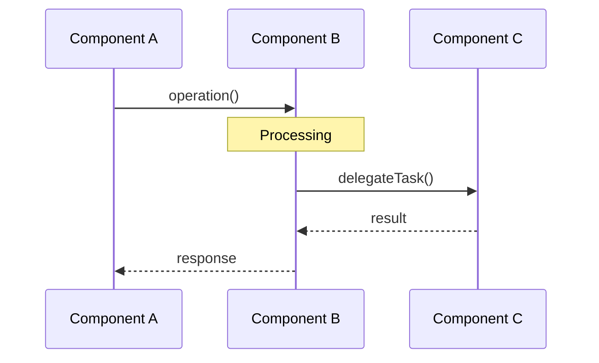
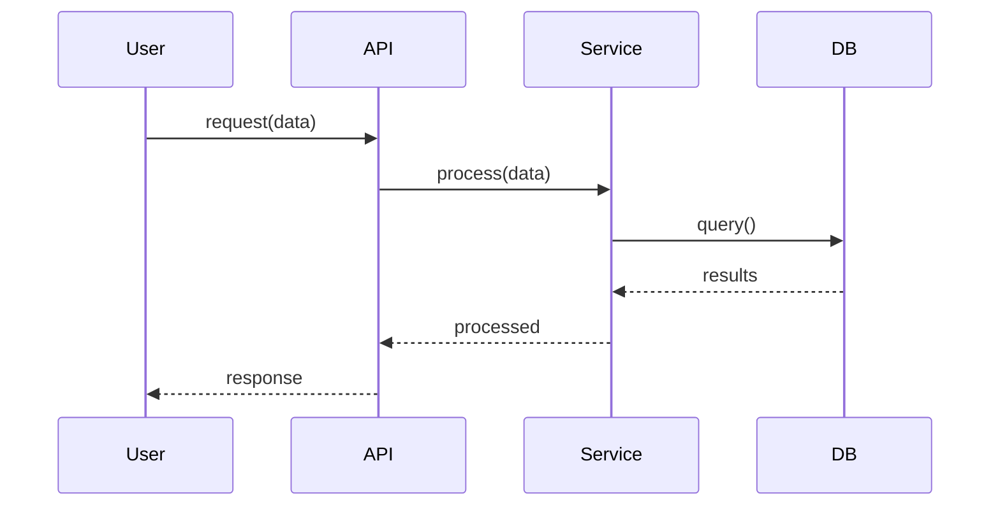
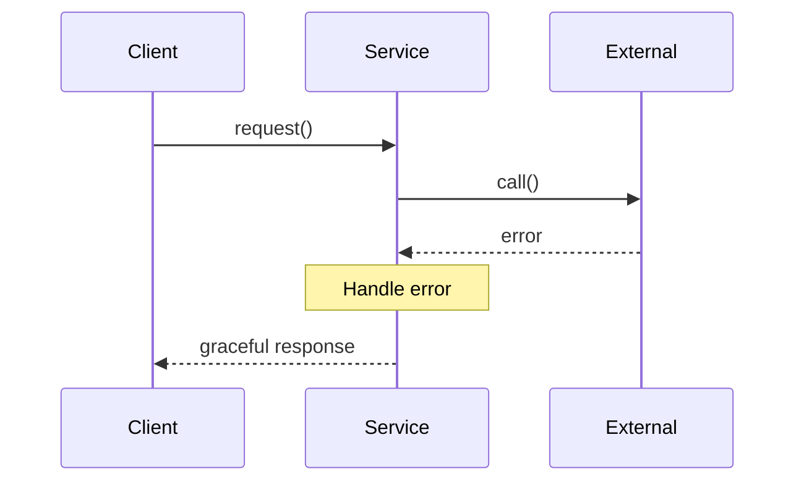
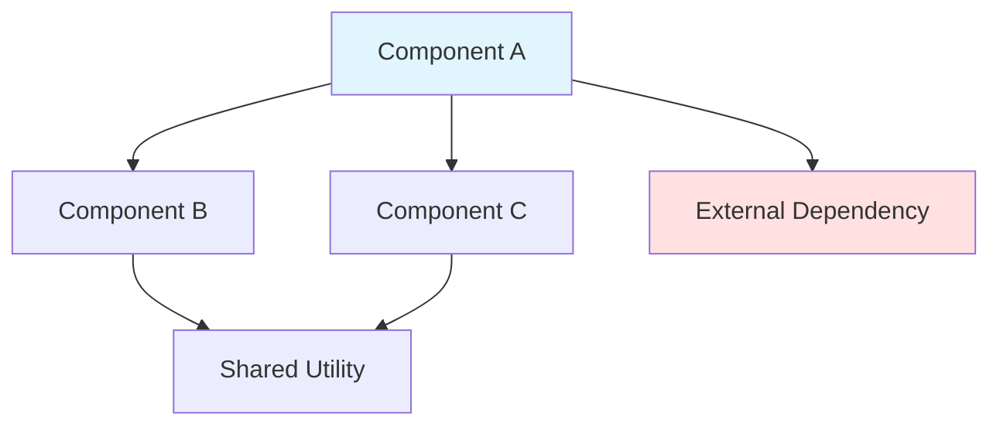
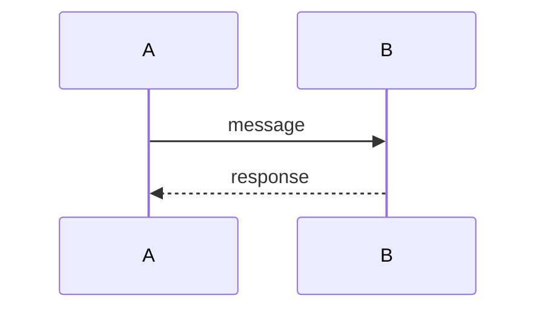
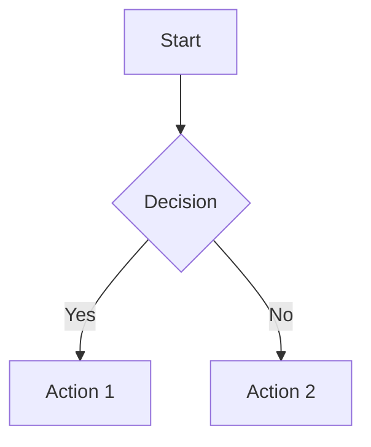
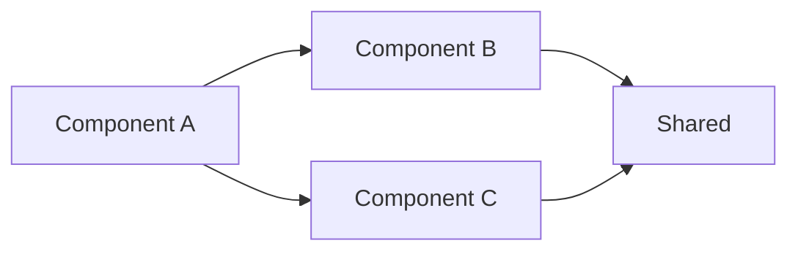

# Code Review Report: {TICKET_ID}

**Ticket:** {TICKET_ID} - {TICKET_NAME}
**Reviewed:** {DATE}
**Reviewer:** code-reviewer agent

---

## 1. Executive Summary

**Purpose:** High-level assessment for quick consumption by stakeholders.

**Ticket:** {TICKET_ID}
**Implementation:** {Brief description of what was built}
**Confidence Score:** {XX}/100 ({interpretation})

### Assessment

{2-3 paragraph overall assessment covering:
- What was implemented and its purpose
- Overall quality and completeness
- Key strengths and primary concerns
- Alignment with requirements}

### Top Concerns

1. {Concern 1: specific issue with impact}
2. {Concern 2: specific issue with impact}
3. {Concern 3: specific issue with impact}

### Top Strengths

1. {Strength 1: positive aspect worth highlighting}
2. {Strength 2: positive aspect worth highlighting}
3. {Strength 3: positive aspect worth highlighting}

**Recommendation:** {PROCEED | PROCEED WITH CAUTION | HOLD FOR FIXES}

**Process:**
1. Summarize what the ticket implemented
2. State confidence score and interpretation
3. List top 3 concerns and top 3 strengths
4. Provide proceed/caution/hold recommendation

**Completeness Criteria:**
- Confidence score present with interpretation
- At least 3 concerns and 3 strengths identified (or "None significant" if truly none)
- Clear recommendation stated

---

## 2. Sequence Diagrams

**Purpose:** Visualize system behavior through lifecycle and data flows.

### 2.1 Lifecycle Flow

{Description of what this diagram shows - the primary lifecycle or workflow implemented}



### 2.2 Data Flow

{Description of data movement through the system}



### 2.3 Error Handling Flow

{Description of error scenarios and recovery}



### 2.4 Observations

- {Observation about flow 1: potential bottleneck, race condition, etc.}
- {Observation about flow 2: good error handling, clear separation, etc.}
- {Observation about flow 3: edge cases, failure modes}

**Process:**
1. Identify key operations implemented
2. Create Mermaid sequence diagram for primary lifecycle flow
3. Create Mermaid sequence diagram for data flow
4. Create Mermaid sequence diagram for error scenarios
5. Annotate potential issues in observations

**Completeness Criteria:**
- At least one lifecycle diagram
- At least one data flow diagram (if data operations present)
- At least one error handling diagram (if error scenarios exist)
- All diagrams use valid Mermaid syntax
- Observations documented

---

## 3. Component Architecture & Dependency Map

**Purpose:** Document system structure and component relationships.

### 3.1 Components

| Component | Responsibility | Files |
|-----------|---------------|-------|
| {Component Name} | {Purpose and key responsibilities} | {file paths} |
| {Component Name} | {Purpose and key responsibilities} | {file paths} |
| {Component Name} | {Purpose and key responsibilities} | {file paths} |

### 3.2 Dependency Graph



### 3.3 Coupling Analysis

- **Tight coupling:** {Description of tight coupling if present, or "None identified"}
- **Loose coupling:** {Positive patterns observed - dependency injection, interfaces, etc.}
- **Circular dependencies:** {None found OR description with concern level}
- **Dependency direction:** {Clean/Concerning - are dependencies pointing the right way?}

### 3.4 Concerns

- {Architectural concern 1: excessive coupling, missing abstraction, etc.}
- {Architectural concern 2}
- {Architectural concern 3 or "No significant concerns"}

**Process:**
1. Identify all components created/modified
2. Map dependencies between components
3. Create Mermaid flowchart or graph
4. Analyze coupling strength and direction
5. Check for circular dependencies
6. Note architectural concerns

**Completeness Criteria:**
- Component table populated with all major components
- Dependency graph present and valid Mermaid
- Coupling analysis performed
- Circular dependency check completed
- Concerns explicitly listed

---

## 4. User Journeys

**Purpose:** Document how users interact with implemented features.

### 4.1 Primary Journey: {Name}

**Actor:** {User type - end user, developer, admin, etc.}
**Goal:** {What they want to accomplish}

1. User {action 1}
2. System {response 1}
3. User {action 2}
4. System {response 2}
5. User {action 3}
6. Outcome: {Successful result}

**Friction Points:**
- {Issue 1: confusing step, missing feedback, etc.}
- {Issue 2: excessive steps, unclear error message, etc.}

### 4.2 Secondary Journey: {Name}

**Actor:** {User type}
**Goal:** {What they want to accomplish}

1. User {action 1}
2. System {response 1}
3. Outcome: {Result}

**Friction Points:**
- {Issue or "None identified"}

### 4.3 Edge Case Journeys

- **{Edge case journey 1}:** {Description of unusual but valid path}
- **{Edge case journey 2}:** {Description of error recovery path}
- **{Edge case journey 3}:** {Description of alternative flow}

### 4.4 Accessibility Considerations

- {Keyboard navigation support: Yes/No/Partial}
- {Screen reader compatibility: Yes/No/N/A}
- {Error messages clear and actionable: Yes/No}
- {Other accessibility concerns}

**Process:**
1. Identify user-facing features implemented
2. Map typical user journeys through features
3. Note friction points or UX concerns
4. Consider edge case journeys
5. Evaluate accessibility implications

**Completeness Criteria:**
- At least one primary user journey documented
- Friction points identified
- Edge case journeys considered
- Accessibility evaluated
- Mark "N/A - Internal/Backend Only" if purely internal work with no user interaction

---

## 5. Risk Analysis

**Purpose:** Identify what could go wrong in production.

### Risk Matrix

| Risk | Probability | Impact | Mitigation | Status |
|------|-------------|--------|------------|--------|
| {Risk 1} | Low/Med/High | Low/Med/High | {Mitigation in place} | Mitigated/Open |
| {Risk 2} | Low/Med/High | Low/Med/High | {Mitigation in place} | Mitigated/Open |
| {Risk 3} | Low/Med/High | Low/Med/High | {Mitigation needed} | Open |

### 5.1 Critical Risks

{Description of any critical risks (high probability + high impact) or "None identified"}

### 5.2 Operational Risks

- **Deployment risks:** {Risk and status - rollback plan, feature flags, etc.}
- **Monitoring gaps:** {Missing alerts, metrics, logs}
- **Runbook completeness:** {Documentation for operations}

### 5.3 Data Integrity Risks

- **Data loss potential:** {Scenarios where data could be lost}
- **Data corruption scenarios:** {Scenarios where data could be corrupted}
- **Backup/recovery:** {Adequacy of backup and recovery mechanisms}

### 5.4 Single Points of Failure

- {Identified SPOF 1: service, database, external dependency}
- {Identified SPOF 2}
- {Or "None identified"}

### 5.5 Availability Risks

- **Scalability limits:** {Known capacity limits}
- **Failure cascades:** {Risk of failures spreading}
- **Degradation strategy:** {Graceful degradation plan}

**Process:**
1. Apply systematic risk identification:
   - Operational risks (deployment, monitoring)
   - Integration risks (external dependencies)
   - Data risks (integrity, loss, corruption)
   - Availability risks (single points of failure, capacity)
2. Rate probability and impact
3. Note existing mitigations
4. Identify critical risks requiring immediate attention

**Completeness Criteria:**
- Risk matrix populated with key risks
- Four risk categories evaluated
- Each risk has mitigation status
- Critical risks highlighted
- Single points of failure identified

---

## 6. Edge Case Analysis

**Purpose:** Identify scenarios that might be missed by normal testing.

### 6.1 Input Boundaries

| Input | Edge Case | Handled? | Notes |
|-------|-----------|----------|-------|
| {Field/Parameter} | Empty/null | Yes/No/Partial | {How handled or gap} |
| {Field/Parameter} | Max length | Yes/No/Partial | {How handled or gap} |
| {Field/Parameter} | Special chars | Yes/No/Partial | {How handled or gap} |
| {Field/Parameter} | Invalid type | Yes/No/Partial | {How handled or gap} |
| {Field/Parameter} | Boundary values | Yes/No/Partial | {How handled or gap} |

### 6.2 State Transitions

- **Concurrent operations:** {Handled? How? Gaps?}
- **Interrupted operations:** {Recovery mechanism or gap}
- **State machine edge cases:** {Invalid transitions prevented?}
- **Idempotency:** {Operations safe to retry?}

### 6.3 Failure Scenarios

| Failure | Handling | Recovery | Notes |
|---------|----------|----------|-------|
| Network timeout | {how handled} | {recovery strategy} | {concerns or OK} |
| Disk full | {how handled} | {recovery strategy} | {concerns or OK} |
| Memory exhaustion | {how handled} | {recovery strategy} | {concerns or OK} |
| External API failure | {how handled} | {recovery strategy} | {concerns or OK} |
| Database unavailable | {how handled} | {recovery strategy} | {concerns or OK} |

### 6.4 Race Conditions

- **{Potential race condition 1}:** {Mitigated? How? Or gap identified}
- **{Potential race condition 2}:** {Mitigated? How? Or gap identified}
- {Or "None identified given single-threaded/sequential nature"}

### 6.5 Resource Exhaustion

- **Large inputs:** {Handling of unexpectedly large data}
- **Long-running operations:** {Timeouts, cancellation}
- **Memory leaks:** {Potential for unbounded growth}

### 6.6 Gaps Identified

- [ ] {Unhandled edge case 1 with severity}
- [ ] {Unhandled edge case 2 with severity}
- [ ] {Unhandled edge case 3 with severity}
- {Or "No significant gaps identified"}

**Process:**
1. Analyze input boundaries (empty, null, max, special chars, invalid types)
2. Consider state transitions (concurrent, interrupted, invalid)
3. Evaluate failure scenarios (network, disk, memory, external dependencies)
4. Check resource exhaustion cases
5. Consider timing/race conditions
6. Document all gaps explicitly

**Completeness Criteria:**
- Input boundaries analyzed for all key inputs
- State transitions considered
- Failure scenarios evaluated
- Race conditions assessed
- Resource exhaustion considered
- Gaps explicitly listed

---

## 7. Code Quality Evaluation

**Purpose:** Assess maintainability, readability, and adherence to patterns.

### 7.1 Overall Quality Rating: {A/B/C/D/F}

{Justification for rating}

### 7.2 Structure & Organization

- **Strengths:**
  - {Positive aspect 1: clear separation of concerns, logical file organization}
  - {Positive aspect 2: consistent module structure}

- **Concerns:**
  - {Issue 1: mixed responsibilities, unclear boundaries}
  - {Issue 2 or "None"}

### 7.3 Naming Conventions

- **Adherence to patterns:** {Good/Fair/Poor}
- **Consistency:** {Consistent throughout/Some inconsistencies}
- **Clarity:** {Self-documenting names/Some unclear names}
- **Notable issues:** {Specific examples or "None"}

### 7.4 Error Handling

- **Consistency:** {Consistent error handling pattern/Inconsistent approaches}
- **Coverage:** {Comprehensive/Partial/Minimal}
- **Error messages:** {Clear and actionable/Cryptic or missing}
- **Specific issues:**
  - {Issue 1: swallowed errors, missing context}
  - {Issue 2 or "None"}

### 7.5 Test Quality

- **Coverage:** {Estimated percentage or Good/Fair/Poor}
- **Test types present:** {Unit/Integration/E2E - which are present}
- **Test quality:** {Well-structured/Adequate/Needs improvement}
- **Test concerns:**
  - {Concern 1: missing test cases, brittle tests}
  - {Concern 2 or "None"}

### 7.6 Documentation

- **Inline comments:** {Adequate/Sparse/Excessive}
- **API documentation:** {Present and complete/Present but incomplete/Missing}
- **README updates:** {Yes/No/N/A}
- **Examples provided:** {Yes/No/N/A}
- **Concerns:** {List or "None"}

### 7.7 Pattern Adherence

- **Followed patterns:**
  - {Pattern 1: DRY, SOLID principle, etc.}
  - {Pattern 2: consistent with codebase conventions}

- **Deviated patterns:**
  - {Deviation 1: with justification assessment - justified/unjustified}
  - {Deviation 2 or "None"}

### 7.8 Code Smells

- **Duplicated code:** {Instances found or "Minimal"}
- **Long functions/methods:** {Count exceeding threshold}
- **Deep nesting:** {Complexity concerns}
- **Magic numbers/strings:** {Unextracted constants}
- **Other smells:** {List or "None significant"}

**Process:**
1. Review code structure and organization
2. Check naming conventions for consistency and clarity
3. Evaluate error handling consistency and coverage
4. Assess test coverage and quality
5. Check documentation completeness
6. Compare against codebase patterns
7. Identify code smells

**Completeness Criteria:**
- Quality rating assigned with justification
- All subsections evaluated
- Specific examples provided for concerns
- Pattern comparison completed
- Code smells identified

---

## 8. Security Review

**Purpose:** Evaluate security posture of implementation.

### 8.1 Security Rating: {SECURE/CONCERNS/VULNERABLE}

{Justification for rating}

### 8.2 Authentication & Authorization

- **Mechanism:** {Description of auth mechanism used}
- **Proper implementation:** {Yes/Concerns}
- **Issues:** {List or "None identified"}

### 8.3 Input Validation

| Input Point | Validation | Sanitization | Status |
|-------------|------------|--------------|--------|
| {endpoint/field} | {Yes/No/Partial} | {Yes/No/N/A} | {OK/CONCERN} |
| {endpoint/field} | {Yes/No/Partial} | {Yes/No/N/A} | {OK/CONCERN} |
| {endpoint/field} | {Yes/No/Partial} | {Yes/No/N/A} | {OK/CONCERN} |

### 8.4 Data Protection

- **Sensitive data identified:** {List of sensitive data types}
- **Encryption at rest:** {Yes/No/N/A - with details}
- **Encryption in transit:** {Yes/No/N/A - HTTPS, TLS, etc.}
- **PII handling:** {Compliant with regulations/Concerns/N/A}
- **Data retention:** {Policy defined/Not addressed}

### 8.5 Injection Vulnerabilities

- **SQL injection:** {Protected via parameterized queries/At Risk/N/A}
- **Command injection:** {Protected/At Risk/N/A}
- **XSS:** {Protected via sanitization/At Risk/N/A}
- **Path traversal:** {Protected/At Risk/N/A}
- **Other injection risks:** {List or "None identified"}

### 8.6 Secrets Management

- **Hardcoded secrets found:** {Yes (CRITICAL)/No}
- **Environment variable usage:** {Proper/Improper/N/A}
- **Secrets in logs:** {Not logged/Risk of exposure}
- **Secrets in version control:** {None found/CRITICAL if found}

### 8.7 Dependency Security

- **Known vulnerabilities:** {None/List from security audit}
- **Outdated dependencies:** {List or "All current"}
- **Supply chain risks:** {Assessment}

### 8.8 Additional Security Concerns

- **CSRF protection:** {Implemented/Not needed/Missing}
- **Rate limiting:** {Implemented/Not needed/Missing}
- **Security headers:** {Configured/Missing}
- **Other concerns:** {List or "None"}

**Process:**
1. Check authentication/authorization implementation
2. Review input validation and sanitization
3. Assess data protection (encryption, PII handling)
4. Evaluate injection vulnerabilities
5. Check for secrets exposure
6. Review dependency security
7. Consider additional attack vectors

**Completeness Criteria:**
- Security rating assigned
- All attack vectors evaluated
- Input validation table populated
- Secrets check completed
- Dependency audit performed (if applicable)
- Specific vulnerabilities documented

---

## 9. Performance Review

**Purpose:** Evaluate efficiency and scalability.

### 9.1 Performance Rating: {OPTIMAL/ACCEPTABLE/CONCERNS/POOR}

{Justification for rating}

### 9.2 Critical Paths

| Path | Complexity | Concern Level | Notes |
|------|------------|---------------|-------|
| {operation/endpoint} | O(n)/O(n^2)/etc | Low/Med/High | {optimization opportunity or OK} |
| {operation/endpoint} | O(n)/O(n^2)/etc | Low/Med/High | {optimization opportunity or OK} |

### 9.3 Database Operations

- **N+1 queries:** {Found in specific locations/None detected}
- **Missing indexes:** {List or "None identified"}
- **Query optimization:** {Good/Needs work - specific issues}
- **Connection pooling:** {Implemented/Not needed/Missing}
- **Transaction usage:** {Appropriate/Excessive/Missing where needed}

### 9.4 Resource Usage

- **Memory patterns:**
  - {Concern 1: memory leaks, unbounded growth}
  - {Or "Efficient - no concerns"}

- **CPU patterns:**
  - {Concern 1: inefficient algorithms, unnecessary computation}
  - {Or "Efficient - no concerns"}

- **Network calls:**
  - {Optimized - batching, caching/Chatty - excessive calls}
  - {Specific issues or "Good"}

### 9.5 Caching

- **Strategy:** {Description of caching approach or "No caching implemented"}
- **Appropriateness:** {Good fit/Could improve/Missing where needed}
- **Cache invalidation:** {Handled correctly/Potential stale data issues}
- **Concerns:** {List or "None"}

### 9.6 Scalability Assessment

- **Horizontal scaling:** {Ready/Blockers: list specific issues}
- **Vertical limits:** {Known limits and thresholds}
- **Bottlenecks:** {Identified bottlenecks requiring attention}
- **Load testing needed:** {Recommendations}

### 9.7 Performance Optimizations Applied

- {Optimization 1: description}
- {Optimization 2: description}
- {Or "None applied - performance adequate for current scale"}

**Process:**
1. Identify performance-critical paths
2. Analyze algorithmic complexity
3. Check for N+1 queries and database inefficiencies
4. Evaluate resource usage patterns
5. Assess caching strategy
6. Consider scalability implications

**Completeness Criteria:**
- Performance rating assigned
- Critical paths analyzed with complexity
- Database operations reviewed (if applicable)
- Resource usage patterns evaluated
- Caching strategy assessed
- Scalability considered
- Bottlenecks identified

---

## 10. Cross-Domain Considerations

**Purpose:** Evaluate integration with external systems and cross-cutting concerns.

### 10.1 External Integrations

| System | Integration Type | Contract | Stability | Notes |
|--------|-----------------|----------|-----------|-------|
| {System} | REST/GraphQL/CLI/etc | {versioned?} | Stable/Fragile | {concerns} |
| {System} | {Type} | {Contract} | {Stability} | {concerns} |

### 10.2 API Contracts

- **Breaking changes introduced:** {Yes (list specific changes)/No}
- **Backwards compatibility:** {Maintained/Broken - with impact}
- **Versioning strategy:** {Implemented/Not addressed}
- **Deprecation notices:** {Needed/Added/N/A}

### 10.3 Cross-Cutting Concerns

- **Logging:**
  - **Coverage:** {Adequate/Sparse/Excessive}
  - **Log levels appropriate:** {Yes/No}
  - **Structured logging:** {Yes/No}
  - **Concerns:** {List or "None"}

- **Monitoring hooks:**
  - **Metrics instrumented:** {Yes/No - which metrics}
  - **Health checks:** {Implemented/Missing}
  - **Concerns:** {List or "None"}

- **Error tracking:**
  - **Integration:** {Sentry/etc integrated/Missing}
  - **Error context:** {Adequate/Insufficient}

- **Distributed tracing:**
  - **Implemented:** {Yes/No/N/A}
  - **Trace context propagated:** {Yes/No}

### 10.4 Environment Considerations

- **Dev/Prod parity:** {Good/Issues: list specific differences}
- **Configuration management:** {Good - environment variables/Hardcoded values}
- **Environment-specific bugs:** {Risk areas to test}
- **Secrets management:** {Per environment/Concerns}

### 10.5 Observability

- **Can we debug in production?** {Yes/Limited/No}
- **Missing observability:**
  - {Gap 1: missing logs, metrics, traces}
  - {Gap 2 or "None"}

- **Debugging challenges:** {Anticipated issues}

### 10.6 Integration Testing

- **Integration tests present:** {Yes/No/Partial}
- **External dependencies mocked:** {Appropriately/Issues}
- **Contract tests:** {Implemented/Needed/N/A}

**Process:**
1. Identify external integrations
2. Assess API contract stability
3. Review cross-cutting concerns (logging, monitoring, error tracking)
4. Check for environment-specific issues
5. Evaluate observability and debugging capability

**Completeness Criteria:**
- External integrations documented
- API compatibility assessed
- Cross-cutting concerns evaluated (logging, monitoring, errors)
- Environment considerations addressed
- Observability gaps identified

---

## 11. Meta-Analysis

**Purpose:** Self-review of the review process itself.

### 11.1 Review Limitations

- {Limitation 1: e.g., "Could not execute performance tests in production-like environment"}
- {Limitation 2: e.g., "Security review based on code analysis only, no penetration testing"}
- {Limitation 3: e.g., "Limited understanding of domain-specific requirements"}

### 11.2 Areas Requiring Deeper Expertise

- **{Area 1}:** Recommend {specialist type - e.g., security expert, DBA, domain expert}
- **{Area 2}:** Recommend {specialist type}
- {Or "No specialized expertise required beyond this review"}

### 11.3 Assumptions Made

- {Assumption 1: e.g., "Assumed production environment has X configuration"}
- {Assumption 2: e.g., "Assumed existing authentication middleware handles Y"}
- {Assumption 3: e.g., "Assumed requirements in planning doc are complete"}

### 11.4 Recommended Follow-up

- [ ] {Follow-up action 1: e.g., "Security penetration testing before production"}
- [ ] {Follow-up action 2: e.g., "Load testing with realistic data volumes"}
- [ ] {Follow-up action 3: e.g., "Domain expert review of business logic"}
- {Or "No additional follow-up needed"}

### 11.5 Confidence in This Review

- **High confidence areas:**
  - {Area 1: e.g., "Code quality and structure assessment"}
  - {Area 2: e.g., "Dependency and integration analysis"}

- **Lower confidence areas:**
  - {Area 1: e.g., "Performance characteristics without load testing"}
  - {Area 2: e.g., "Security assessment without dedicated security tooling"}

### 11.6 Review Scope

- **In scope:** {What was reviewed}
- **Out of scope:** {What was intentionally not reviewed}
- **Could not review:** {What couldn't be reviewed due to limitations}

**Process:**
1. Identify limitations of this review
2. Note areas requiring deeper expertise
3. Acknowledge assumptions made
4. Suggest follow-up analysis
5. Self-assess confidence levels

**Completeness Criteria:**
- Limitations acknowledged honestly
- Expertise gaps identified
- Assumptions documented
- Follow-up actions listed
- Confidence levels stated for different areas

---

## 12. Confidence Score & Recommendations

**Purpose:** Provide quantified assessment and prioritized action items.

### 12.1 Confidence Score

| Dimension | Weight | Score | Notes |
|-----------|--------|-------|-------|
| Correctness | 20% | X/10 | {Brief justification - does it work as specified?} |
| Security | 15% | X/10 | {Brief justification - vulnerabilities present?} |
| Performance | 10% | X/10 | {Brief justification - acceptable performance?} |
| Maintainability | 15% | X/10 | {Brief justification - easily maintained?} |
| Test Coverage | 15% | X/10 | {Brief justification - well tested?} |
| Edge Cases | 10% | X/10 | {Brief justification - edge cases handled?} |
| Integration | 10% | X/10 | {Brief justification - integrates well?} |
| Documentation | 5% | X/10 | {Brief justification - adequately documented?} |

**Calculation:**
```
Total = (Correctness × 0.20 + Security × 0.15 + Performance × 0.10 +
         Maintainability × 0.15 + Test Coverage × 0.15 + Edge Cases × 0.10 +
         Integration × 0.10 + Documentation × 0.05) × 10
```

**Total Score: {XX}/100**

**Interpretation:** {interpretation from table below}

| Range | Interpretation | Guidance |
|-------|----------------|----------|
| 90-100 | Excellent | Proceed confidently to production |
| 80-89 | Good | Proceed, address MEDIUM items in follow-up |
| 70-79 | Acceptable | Proceed with caution, prioritize HIGH items |
| 60-69 | Concerns | Address HIGH items before proceeding |
| <60 | Significant Issues | Address CRITICAL items, consider rework |

---

### 12.2 Recommendations

#### CRITICAL (Must Fix Before Merge)

**Criteria:** Security vulnerabilities, data loss risk, breaking changes, system instability

- [ ] {Issue}: {Description} - {Location/File}
- [ ] {Issue}: {Description} - {Location/File}

{Or "None"}

---

#### HIGH (Should Fix Before Merge)

**Criteria:** Bugs likely in common scenarios, significant performance issues, missing critical error handling

- [ ] {Issue}: {Description} - {Location/File}
- [ ] {Issue}: {Description} - {Location/File}
- [ ] {Issue}: {Description} - {Location/File}

{Or "None"}

---

#### MEDIUM (Could Fix or Defer)

**Criteria:** Code quality issues, missing tests for edge cases, documentation gaps, minor UX issues

- [ ] {Issue}: {Description} - {Location/File}
- [ ] {Issue}: {Description} - {Location/File}

{Or "None"}

---

#### NITPICK (Optional Improvements)

**Criteria:** Style issues, minor improvements, optional enhancements, refactoring suggestions

- [ ] {Issue}: {Description} - {Location/File}
- [ ] {Issue}: {Description} - {Location/File}

{Or "None"}

---

### 12.3 Summary

**Total Recommendations:**
- CRITICAL: {count}
- HIGH: {count}
- MEDIUM: {count}
- NITPICK: {count}

**Proceed Status:** {PROCEED | PROCEED WITH CAUTION | HOLD FOR FIXES}

**Rationale:** {Brief explanation of proceed status based on confidence score and recommendation severity}

**Next Steps:**

1. {Recommended action 1: e.g., "Address CRITICAL security vulnerability in auth.ts"}
2. {Recommended action 2: e.g., "Add integration tests for external API calls"}
3. {Recommended action 3: e.g., "Create PR and proceed to code review"}

---

**Process:**
1. Calculate score using 8-dimension rubric
2. Generate interpretation from score table
3. Compile and categorize all recommendations from previous sections
4. Prioritize by severity using defined criteria
5. Provide clear proceed/caution/hold guidance

**Completeness Criteria:**
- All 8 dimensions scored with justification
- Total score calculated correctly using formula
- Interpretation provided based on score range
- All recommendations categorized by severity
- Summary counts accurate
- Proceed status clear with rationale
- Next steps actionable and prioritized

---

## Appendix: Methodology Reference

### Confidence Score Rubric

| Dimension | Weight | Criteria |
|-----------|--------|----------|
| Correctness | 20% | Does it work as specified? Tests passing? Requirements met? |
| Security | 15% | Are there security vulnerabilities? Proper auth/input validation? |
| Performance | 10% | Will it perform acceptably? Scalability considered? |
| Maintainability | 15% | Can it be maintained easily? Clear structure? Good naming? |
| Test Coverage | 15% | Is it well tested? Unit/integration tests present? |
| Edge Cases | 10% | Are edge cases handled? Boundary conditions tested? |
| Integration | 10% | Does it integrate well? API contracts stable? |
| Documentation | 5% | Is it documented? README updated? Comments adequate? |

### Recommendation Categories

| Category | Criteria | Action Required |
|----------|----------|-----------------|
| CRITICAL | Security vulnerabilities, data loss risk, breaking changes, system instability | MUST fix before merge |
| HIGH | Bugs likely in common scenarios, significant performance issues, missing critical error handling | SHOULD fix before merge |
| MEDIUM | Code quality issues, missing tests for edge cases, documentation gaps, minor UX friction | COULD fix now or defer to follow-up |
| NITPICK | Style issues, minor improvements, optional enhancements, refactoring suggestions | Optional - nice to have |

### Mermaid Diagram Examples

**Sequence Diagram:**


**Flowchart:**


**Graph:**


---

**Template Version:** 1.0
**Created:** {DATE}
**Last Updated:** {DATE}
