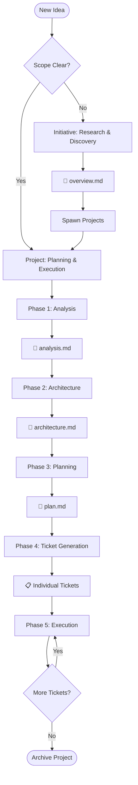
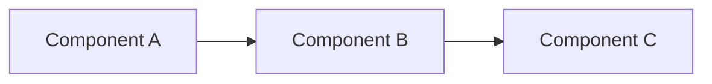
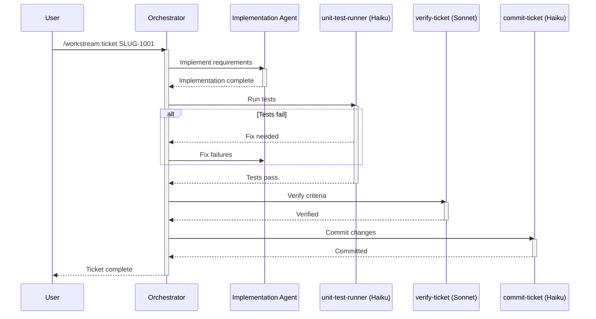

# Spec-Driven Development with Workstream

## Process Overview



---

## Workflow Hierarchy

### Initiatives (Optional - Research Phase)

**When to use:** Exploring problem spaces, conducting research before knowing exact deliverables.

**Location:** `.crewchief/initiatives/{DATE}_{name}/`

**Documents:**
- `overview.md` - Vision, goals, research findings
- `opportunity-map.md` - Problem space analysis
- `domain-model.md` - Key concepts and relationships
- `decisions.md` - Research decisions and rationale

**Command:** `/workstream:initiative-create [name]`

### Projects (Planning & Execution)

**When to use:** Known deliverables, ready for planning and execution.

**Location:** `.crewchief/projects/{SLUG}_{name}/`

**Documents:**
- `README.md` - Project overview and status
- `planning/analysis.md` - Problem analysis and research
- `planning/architecture.md` - Technical design
- `planning/plan.md` - Implementation phases and tickets
- `planning/quality-strategy.md` - Testing approach
- `planning/security-review.md` - Security considerations

**Command:** `/workstream:project-create [description]`

### Tickets (Individual Work Items)

**Location:** `.crewchief/projects/{SLUG}_{name}/tickets/{SLUG}-{NUMBER}_description.md`

**Workflow:** Implement → Test → Verify → Commit

**Command:** `/workstream:ticket [TICKET_ID]`

---

## Phase 1: Analysis

### Purpose
Understand the problem space, research solutions, and establish project context.

### Process
```bash
# Scaffold project structure
bash scripts/scaffold-project.sh "SLUG" "project-name"

# Delegate to project-planner agent (Sonnet)
```

### Output: `planning/analysis.md`

```markdown
# Analysis

## Executive Summary
[1-2 paragraph overview of findings and recommendations]

## Problem Statement
### Current State
- What exists today
- Pain points
- Constraints

### Desired State
- Goals
- Success metrics
- User outcomes

## Research Findings
### Technical Landscape
- Available technologies
- Build vs buy options
- Integration requirements

## Feasibility Assessment
### Technical Feasibility
- Required technologies
- Skill requirements
- Technical risks

### Resource Feasibility
- Complexity assessment
- Dependency analysis

## Constraints & Assumptions
### Constraints
- Technical limitations
- Business requirements

### Assumptions
- What we're taking as given
- Dependencies on other systems

## Risk Analysis
| Risk | Probability | Impact | Mitigation Strategy |
|------|------------|--------|-------------------|
| [Risk] | High/Med/Low | High/Med/Low | [Strategy] |

## Recommendations
[Specific recommendation based on analysis]
```

---

## Phase 2: Architecture

### Purpose
Define the technical architecture, component design, and system structure.

### Output: `planning/architecture.md`

```markdown
# Architecture

## System Overview
[High-level description of the system architecture]

## Architecture Diagram


## Component Design
### Component: [Name]
#### Purpose
[What this component does]

#### Responsibilities
- Responsibility 1
- Responsibility 2

#### Interfaces
- Input: [Description]
- Output: [Description]

## Data Architecture
### Data Models
[Entity definitions and relationships]

### Data Flow
[How data moves through the system]

## Integration Points
| System | Type | Protocol | Format |
|--------|------|----------|--------|
| [System] | Sync/Async | REST/gRPC | JSON |

## Technical Decisions
### Decision: [Choice]
- **Options:** A, B, C
- **Decision:** [What was chosen]
- **Rationale:** [Why]
```

---

## Phase 3: Planning

### Purpose
Break down the architecture into implementable phases and specific tickets.

### Output: `planning/plan.md`

```markdown
# Implementation Plan

## Phase Overview
| Phase | Name | Deliverable | Success Criteria |
|-------|------|-------------|------------------|
| 1 | Foundation | Core infrastructure | Basic tests pass |
| 2 | Core Features | Main functionality | Features working |
| 3 | Integration | External connections | APIs connected |

## Phase 1: Foundation
### Goals
- Set up development environment
- Create project structure
- Implement core data models

### Tickets
| Ticket ID | Title | Description |
|-----------|-------|-------------|
| SLUG-1001 | Setup repository | Initialize structure |
| SLUG-1002 | Core data models | Entity definitions |

### Exit Criteria
- [ ] Development environment working
- [ ] Core models implemented
- [ ] Basic tests passing

## Phase 2: Core Features
[Continue pattern...]
```

---

## Phase 4: Ticket Generation

### Purpose
Transform plan items into detailed, executable work tickets.

### Process
```bash
# Delegate to ticket-creator agent (Sonnet)
/workstream:project-tickets [PROJECT_SLUG]
```

### Ticket Template

```markdown
# {SLUG}-{NUMBER}: Title

## Status
- [ ] **Task completed** - All acceptance criteria met
- [ ] **Tests pass** - All tests executing successfully
- [ ] **Verified** - Verified by verify-ticket agent

## Context
**Project:** [Link to project]
**Dependencies:** [Previous tickets]

## Objective
[Clear statement of what this ticket accomplishes]

## Acceptance Criteria
- [ ] Criterion 1 (specific and measurable)
- [ ] Criterion 2 (specific and measurable)
- [ ] Criterion 3 (specific and measurable)

## Implementation Notes
### Approach
[How to implement this]

### Files to Modify
- `path/to/file1` - [What to change]
- `path/to/file2` - [What to change]

### Patterns to Follow
- Reference: [existing code/pattern]

## Testing Requirements
- [ ] Unit tests for new functionality
- [ ] Integration tests if applicable

## Out of Scope
- [What NOT to do]
```

---

## Phase 5: Agent Execution

### Purpose
Execute tickets through the agent pipeline to completion.

### Execution Flow



### Agent Pipeline

| Step | Agent | Model | Purpose |
|------|-------|-------|---------|
| 1 | Implementation | Sonnet | Build the solution |
| 2 | `unit-test-runner` | Haiku | Execute tests, report results |
| 3 | `verify-ticket` | Sonnet | Verify acceptance criteria |
| 4 | `commit-ticket` | Haiku | Create conventional commit |

### Commands

```bash
# Execute single ticket
/workstream:ticket SLUG-1001

# Execute all tickets for a project
/workstream:project-work PROJECT_SLUG

# Check status
/workstream:status PROJECT_SLUG
```

---

## Scripts

All scripts are in the skill's `scripts/` directory:

| Script | Purpose | Usage |
|--------|---------|-------|
| `scaffold-initiative.sh` | Create initiative structure | `bash scripts/scaffold-initiative.sh "name" "vision"` |
| `scaffold-project.sh` | Create project structure | `bash scripts/scaffold-project.sh "SLUG" "name"` |
| `ticket-status.sh` | Get ticket status as JSON | `bash scripts/ticket-status.sh SLUG` |
| `validate-structure.sh` | Verify project structure | `bash scripts/validate-structure.sh SLUG` |
| `project-summary.sh` | Generate project summary | `bash scripts/project-summary.sh SLUG` |

---

## Agents

### Haiku Agents (Fast, Structured Tasks)

Use for procedural tasks with clear steps:

| Agent | Purpose |
|-------|---------|
| `status-reporter` | Parse script output, format reports |
| `structure-validator` | Check file structure, report issues |
| `unit-test-runner` | Execute tests, report results |
| `commit-ticket` | Create commits after verification |

### Sonnet Agents (Reasoning, Analysis)

Use for tasks requiring judgment:

| Agent | Purpose |
|-------|---------|
| `initiative-planner` | Research and plan initiatives |
| `project-planner` | Create comprehensive planning docs |
| `project-reviewer` | Critical review of projects |
| `ticket-creator` | Generate tickets from plans |
| `verify-ticket` | Verify acceptance criteria met |

---

## Quality Gates

### Per-Ticket Gates
1. **Implementation Complete** - Code written
2. **Tests Passing** - All tests green
3. **Verified** - Acceptance criteria met
4. **Committed** - Changes saved

### Per-Project Gates
1. **All Tickets Complete**
2. **Integration Tests Pass**
3. **Documentation Updated**
4. **Ready for Archive**

---

## Delegation Patterns

### Pattern 1: Script → Haiku Agent
For mechanical tasks with formatting:
```
ticket-status.sh → JSON → status-reporter → Formatted markdown
```

### Pattern 2: Sonnet Agent → Script
For planning that creates structure:
```
project-planner decides → scaffold-project.sh creates files
```

### Pattern 3: Sequential Agent Pipeline
For ticket execution:
```
Implementation (Sonnet) → unit-test-runner (Haiku) → verify-ticket (Sonnet) → commit-ticket (Haiku)
```

---

## Best Practices

### Writing Tickets
1. **Be Specific** - Vague instructions cause rework
2. **Include Examples** - Show what success looks like
3. **Reference Patterns** - Point to existing code
4. **Define Boundaries** - What NOT to change
5. **Measurable Criteria** - Not subjective

### Agent Management
1. **Orchestrator Never Implements** - Always delegate
2. **Clear Handoffs** - Each agent's output feeds the next
3. **Fail Fast** - Don't continue if prerequisites fail
4. **Use Scripts First** - Gather data before spawning agents
5. **Prefer Haiku** - When reasoning isn't needed

### Process Improvement
1. **Archive Completed Projects** - Keep workspace clean
2. **Review Before Tickets** - Use `project-reviewer` to catch issues early
3. **Keep Tickets Small** - 2-8 hours scope
4. **Document Decisions** - In project planning docs
