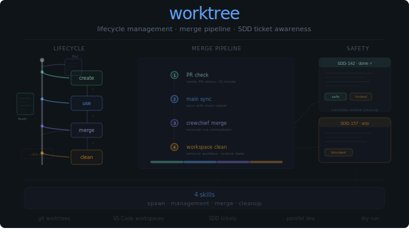

# Worktree Plugin

<p align="center">
  
</p>

Git worktree lifecycle management powered by the crewchief CLI. Work on multiple features simultaneously in isolated directories, merge them back through a four-step pipeline, and clean up safely — with SDD ticket awareness that prevents accidental removal of incomplete work.

## Lifecycle

Four stages, each with its own skill:

**Create** — Spawn a new worktree with `crewchief worktree add`. Automatically updates VS Code workspace files so the new directory appears immediately.

**Use** — Develop in isolation. Each worktree has its own checkout, its own branch, its own working directory. No branch switching, no stashing.

**Merge** — Bring completed work back to main through the merge pipeline. PR status and CI checks are verified before merging.

**Clean** — Remove the worktree directory and optionally delete the branch. SDD ticket status is checked first. Preview with `--dry-run`.

## Merge Pipeline

The merge command (`/worktree:merge`) runs a four-step pipeline:

| Step | Action | What It Does |
|------|--------|--------------|
| 1 | PR check | Verify PR status and CI checks pass |
| 2 | Main sync | Pull latest main to avoid merge conflicts |
| 3 | Crewchief merge | Execute merge via orchestrator |
| 4 | Workspace clean | Remove worktree directory, restore VS Code workspace |

```bash
# Merge with explicit worktree name
/worktree:merge feature-auth

# Auto-detect from current worktree directory
/worktree:merge

# Preview operations first
merge-worktree.sh feature-auth --repo myproject --dry-run
```

Sync operations are available independently for worktrees you want to keep current:

```bash
# Sync with explicit name
/worktree:sync-and-clean feature-auth

# Auto-detect from current directory
/worktree:sync-and-clean
```

## Safety

Before cleaning up a worktree, the plugin checks for associated SDD tickets:

- **Completed tickets** — Safe to clean. Worktree removal proceeds normally.
- **In-progress tickets** — Blocked. You're prompted to confirm before cleanup to prevent losing unfinished work.

## Skills

| Skill | Description |
|-------|-------------|
| [worktree-spawn](skills/worktree-spawn/SKILL.md) | Create worktrees with VS Code workspace integration |
| [worktree-management](skills/worktree-management/SKILL.md) | Core git worktree operations |
| [worktree-merge](skills/worktree-merge/SKILL.md) | Merge pipeline: PR check, sync, merge, cleanup |
| [worktree-cleanup](skills/worktree-cleanup/SKILL.md) | Remove worktrees with SDD ticket awareness |

## Prerequisites

- **crewchief CLI** in your PATH (`crewchief --version`)
- **Git repository** context
- **Clean working state** recommended before creating worktrees

## Installation

```bash
/plugin install worktree@crewchief
```

## Troubleshooting

| Issue | Solution |
|-------|----------|
| `crewchief: command not found` | Verify CLI is installed and in PATH |
| Not a git repository | Navigate to a git repo or run `git init` |
| Worktree already exists | Use `crewchief worktree list`, pick a different name |
| Cannot remove worktree | Commit or stash changes first |
| Merge conflicts | Resolve manually, then `git add` and `git commit` |
| Branch not tracking | Set upstream: `git branch -u origin/<branch>` |
| Sync timeout (120s) | Run git operations manually with no timeout |
| Auto-detect fails | Ensure path matches `/workspace/repos/<repo>/<worktree>` |

## Links

- [Repository](https://github.com/manifoldlogic/claude-code-plugins)
